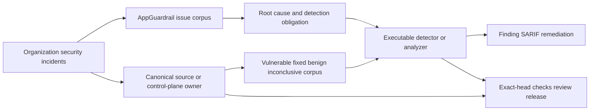

# AppGuardrail product and technical gap baseline

**Scoped refresh:** 2026-09-12  
**Authority:** protected PRD/ADR/architecture plus the exact evidence identified below  
**Status:** active-PR working baseline, not a release, certification, or protected-capability claim  
**Canonical writer:** PR #999, `docs/product-technical-gap-baseline`

## Scope and retained evidence

This refresh verifies the #1036 JSON serialization repair and its current CodeQL/review boundary. It also binds the #1192 Caido bootstrap incident to the current `quarantine-sandbox-runtime` HTTP-readiness owner and its positive-LSM evidence boundary. It does **not** relabel every earlier repository/PR observation as current.

The [complete preceding baseline and corpus inventory](product-technical-gap-baseline-history-6d6d7749.md) is incorporated by reference, byte-for-byte, including every detector obligation, prerequisite, FP/FN boundary, Context Map, Gap, action, source/run/artifact identifier, standards reference, and later evidence appendix. Its source is commit `6d6d77495a73a9ae814b138e53c90e2ea19cd3d6`, Git blob `1953b92c6c6fcfbe9a30e2b78094c214c18e6fe6`. The same-directory retained file preserves existing relative-link resolution. Moving a historical observation into a retained snapshot does not close, waive, complete, or retire any valid delta.

Historical timestamps, PR states, head SHAs, and next-action instructions in that inventory must be re-fetched before execution. Substantive unresolved obligations remain open unless later evidence proves completion; newer governing PRD/ADR and CWL DEVELOPMENT PHILOSOPHY v2026-09-02B take precedence over contradictory historical prose. Only the specifically identified #1036/CodeQL and #1192/readiness-owner observations below supersede their earlier observations. Other lanes are retained, **not reverified in this refresh**.

## Goal and evidence contract

AppGuardrail owns the ContextualWisdomLab security-defect corpus and executable scan/SARIF/remediation boundary. The target is USD 20B sale quality through buyer-visible Gap removal, not increasing a rule count or reducing open PRs by closure.

A retained incident is useful when its causal failure, preconditions and observable signals are explicit; the production detector exercises vulnerable, fixed, benign and inconclusive cases; the actual source owner is repaired; and evidence survives ordinary protected integration. Issue text, registry rows, fixtures, model prose, prior-head results and queued workflows are not executable detector truth. Runtime prevention and scanner detection remain separate obligations.

```text
corpus → causal owner/root cause → RED → smallest safe repair → exact-head Checks
→ independent review → ordinary protected merge → immutable release/consumer bump
→ protected-owner oracle refresh → next corpus obligation / buyer-visible Gap
```

Review/check/deployment waits do not block another independent safe lane. No force push, destructive rebase, self-approval, finding suppression, detection bypass, weakened gates, or predecessor-evidence transfer is permitted. Preserve concurrent intent. No valid PR retires without ordinary merge or verified complete successor carryover under the governing exceptions.

## PRD / TRD / architecture status

The canonical documents remain [PRD](PRD.md), [TRD](TRD.md), [ARCHITECTURE](../ARCHITECTURE.md), [UML](UML.md), [ERD](ERD.md), [TRACEABILITY](TRACEABILITY.md), [THREAT_MODEL](THREAT_MODEL.md), [TEST_STRATEGY](TEST_STRATEGY.md), [OPERABILITY](OPERABILITY.md), and the [ADR index](adr/README.md). This document does not create a competing API, schema, detector kernel, or architecture.

The four product planes remain **scan** (detectors/external-engine provenance), **remediate** (safe transformations and reviewable guidance), **control** (tenant-isolated history/authentication/webhook state), and **assurance** (SARIF/report/SBOM/provenance evidence).

The #1036 change alters only the escaped-codepoint alternative of an existing rule. It introduces no runtime dependency, persistent aggregate, database migration, network behavior, permission, workflow, or publication authority. Existing UML/ERD and component boundaries therefore remain unchanged. Future boundary changes must reconcile the owning PRD/TRD/ADR/UML/ERD and security/operability contracts. Rust remains the default for new security/performance runtime work under current CWL governance; this scoped repair is not permission to create a new Python security runtime.

## Context Map



Product repositories retain their domain truth and vulnerable-runtime repair. `ContextualWisdomLab/.github` owns CI/review/security/release control-plane repair; contextual-orchestrator owns provider discovery/routing/delegation and gateway behavior. External engines retain their source/tool/version identity. AppGuardrail consumes released contracts through its own boundary; an owner candidate branch is not permission to copy its implementation, bypass it, or access its database.

## Security-defect corpus — scoped 2026-09-12 observations

| Work | Exact observed evidence | Root cause and detection boundary | Remaining acceptance |
| --- | --- | --- | --- |
| #1036, `feat/skill-supply-chain-detector` | Head `832d066cd3adf6aa455435bc4ef4b12926514b68`, base `develop@e71d37e7c58118e6764c96ab7c4492fe33eed6f8`; open/Ready. Effective repair from `0ef5715468acb674aeb0f3833e820996d4644871` is three normal commits and three paths. | An existing 78-letter raw Cyrillic alphabet had only 39 lowercase letters in its JSON escape alternative, so equivalent uppercase serialized names evaded `skill-name-homoglyph-confusable`. The fix aligns those representations without changing rule identity, severity, paths, or the other three rules. | Eight source/security workflows succeed. CodeQL settlement and qualifying current-head formal approval remain incomplete. No protected merge or release is claimed. |
| Retained #1031 / #1032 threat inventory; #1099 plugin admission | #1099 comment `5644654564` connects the new regression and candidate to its source corpus. | Raw and escaped spellings of the same supported mixed-script identity need the same finding; Cyrillic-only and description-prose values must not supply false mixed-script evidence. | Retain the original incident as regression provenance. #1099 is not completed by this slice; consumers require the eventual released scanner contract. |
| CodeQL PR `34682258948`, attempt 1 | Target #1036 at `832d066...`; Python job `103523090675` and Actions job `103523090685` failed; dispatch job `103523411245` succeeded. Python log: `DISPATCH_OUTCOME=success`, `VERDICT_STATE=pending`, required run `34682258948`. | A successful request to central scanning does not establish an authenticated terminal language scan/SARIF verdict. This failure is separate from the detector's passing test result. | Preserve non-passing status until terminal exact-tuple evidence exists. No blind rerun, synthetic status, leaf workaround, or approval transfer. |
| Canonical central CodeQL owner #2040 and related #2051 | `.github#2040` comment `5644656829` contains the target/base/head/run/jobs canary for the existing owner session. #2051 separately describes a proposed new-client base-ref title/bootstrap mismatch. | This consumer log uses the protected old title form; its pending result alone does not prove the distinct #2051 mismatch. | Central owner must prove its repair, integrate normally, release an immutable contract, and update consumers. This refresh does not claim that work was performed or released. |
| #1192 → `quarantine-sandbox-runtime` #103 / Draft #104 | Owner head `4d738ccc52a3acb3d6ea621e306f628074c96122`, base `feat/runtime-foundation-tdd@5c6a44bb2b35eb17d0315d72db242f4488c3c426`. Native CI `34270054863`: verify `102209085115`, coverage `102209084826`, branch coverage `102209084792`, and hosted negative rootless/AppArmor `102209084617` succeeded; positive-LSM `102209085130` completed `cancelled` before checkout and emitted no job log. | The #1192 Strix specimen exposed a Caido loopback-readiness boundary. #104 causally repaired TCP-only false readiness, runtime-selected Host authority, and malformed HTTP 2xx admission in the canonical runtime owner. Functional GREEN does not supply effective positive confinement evidence. | Keep #104 Draft. `.github#1590` owns the eligible rootless SELinux runner, #2083 owns the released reusable workflow, and #712 owns queue/materialization health. A cancelled required job maps to `incomplete`; no protected integration, immutable release, or consumer bump is claimed. |

### Actual RED to GREEN execution

RED commit `e33988082a5a2c146d4fa27087c3e766a5409603` adds `tests/test_skill_homoglyph_json_case_equivalence.py`. Its 164 cases exercise the real packaged rule loader and production `_scan_file`: 78 mixed-script cases across raw/lower-hex/upper-hex forms, 78 Cyrillic-only negatives, four description negatives, and four alternate `skill`-key positives. JSON decoding verifies value equivalence independently of the matcher.

Hosted RED Tests run `34682100611`, Python 3.13 job `103522497980`, reported **43 failed / 1161 passed**. These were the 39 uppercase name cases and four alternate-key cases. Production commit `79531336a02a05e10fb194b6b021e91ba48e3353` changed all four escaped-codepoint atoms to the same declared alphabet. Final documentation head is `832d066cd3adf6aa455435bc4ef4b12926514b68`.

Hosted final-head Tests run `34682258917`, Python 3.13 job `103522937485`, reported **1204 passed in 14.91 seconds**. Python 3.11 job `103522937541` also completed successfully. The actual checkout is synthetic merge `f1fff397a326b2226134babbd3592babca0f4280`, merging this exact candidate into the base above. Tests, Security Process, Security Scan, SAST Semgrep, Pinned HTTPS Coverage, OpenSSF Evidence Coverage, Retention Audit Coverage, and Scan path context coverage are terminal-success for the candidate's pull-request runs. These facts do not prove global 100% coverage, every security property, or central required-review completion.

Supplemental local probes compiled the packaged expressions and exhaustively compared all 65,536 BMP escape values with the declared 78-letter alphabet. The local repository clone failed DNS resolution; no local full-suite execution is claimed. This remains bounded serialization parity, not arbitrary JSON/YAML parsing or universal confusable detection.

CodeRabbit comment `3995612697` reviewed the RED head. Reply `3995617271` independently inspected final head `832d066...`, confirmed the repair and production-path regressions, and resolved that source thread. All visible inline threads were resolved at this observation. A resolved finding/comment review is not a qualifying formal APPROVED review, and the old Noema approval cannot transfer to this head.

## Detector-development contract

Each retained claim records root cause, preconditions, independently observable signals, false-positive and false-negative boundaries, canonical owner, vulnerable/fixed/benign/inconclusive regression evidence, and exact-head acceptance. Historical fixed incidents remain in that corpus. Stateful syntax/control-flow that no longer fits a bounded rule must converge on the canonical structural analyzer with differential historical oracles; another regex is not an automatic solution.

The complete per-lane obligations and prerequisite graph remain in the [retained corpus inventory](product-technical-gap-baseline-history-6d6d7749.md). In particular, #1088/#1133/#1152, #1080, #1068/#1107, #998, #963 and its Clearfolio causal owner, the #1099 plugin stack, and the #1117/#1192/#1131 dashboard lanes are not closed, superseded, or newly certified by this refresh.

## Assurance state mapping

Retain the candidate `appguardrail.scan-assurance.v1` field `scan_outcome_code`: `clean`, `findings_present`, `incomplete`, `failed`, or `untrusted`. These names do not turn the unmerged #972/#1005 contracts into released functionality.

| Evidence condition | Mapping | Consumer obligation |
| --- | --- | --- |
| All required current identity/digest-valid evidence completed | `clean` only with zero findings; otherwise `findings_present` | Only `clean` may display Clean Scan; apply finding thresholds to findings_present. |
| Missing, queued, running, cancelled, unavailable, inconclusive, stale, or incomplete required execution/detectors/engines | `incomplete`, preserving the original reason | Withhold a clean result and fail the deploy gate closed. |
| Scanner or requested engine execution failed | `failed` | Preserve failure rather than converting it into zero findings. |
| Malformed evidence, repository/commit/digest/count mismatch, future timestamp, or invalid provenance | `untrusted` | Reject the assurance claim. |

The evidence execution lifecycle remains `completed`/`failed`/`incomplete`; external-engine state remains `completed`/`unavailable`/`failed`/`not_requested`. Dashboard, JSON, SARIF, report and gate consumers must agree on the assurance envelope. Missing envelopes never default to clean. The CodeQL pending handoff above remains a failed required check with its pending-verdict reason, not a successful scan.

## Buyer-visible Gap register

Gap identities are preserved. Unrefreshed evidence and detailed exit criteria remain incorporated from the retained inventory; no row below claims new completion.

| ID | Buyer-visible Gap | Owner / retained work | This refresh / required exit |
| --- | --- | --- | --- |
| G-01 | Prove authoritative source conditions rather than caller assertions. | Source-backed detector/evidence owners | Retained in progress; unchanged-head positive/negative/malformed/unavailable/stale cases and immutable source evidence. |
| G-02 | Prevent zero findings from overstating incomplete assurance. | #972 contract; #1005 and later consumers | Retained active work, not reverified; one JSON/SARIF/dashboard/report/gate outcome with missing evidence non-clean. |
| G-03 | Safely hand remediation/evidence to agent workflows. | Issue #928 / #1006; separate UI/CSP/clipboard work | Retained open; redaction, digest/schema, accessible fallback/focus and hostile-content browser evidence. |
| G-04 | Defensible retention, deletion, audit and recovery. | Tenant-owned control-plane persistence | Retained open; authorization, migration/rollback, backup/restore, immutable audit and release evidence. |
| G-05 | Compact exact-head buyer evidence package. | Assurance/report/operability owners | Retained open; reproducible source/check/artifact/release digests without raw secrets. |
| G-06 | Resolve stateful regex FP/FN divergence structurally. | #1088/#1133/#1152; #1080; #1099 command-state owners | Still in progress. #1036 closes one bounded spelling-parity miss, not the structural-analysis Gap. Preserve historical rule IDs, reachability/state oracles and realistic performance evidence. |
| G-07 | Remove shared required-review/security capacity and settlement failures. | Canonical `.github` / contextual-orchestrator owners | Still open. #2040 has the exact CodeQL consumer canary. The #104 positive-LSM job `102209085130` was cancelled before execution; #1590/#2083/#712 remain the canonical runner/workflow/queue owners. Require authentic terminal evidence, owner GREEN/release and consumer validation. |
| G-08 | Keep the baseline fresh without relabelling stale evidence. | Single writer #999 | Scoped September 12 observations are separate from the exact retained prior blob. Re-fetch all other lanes before action; ordinary integration and future material refreshes remain required. |

## Technical / TRD gaps

Bounded rule successes do not cover unmodeled syntax. Preserve all historical vulnerable and fixed oracles when migrating stateful detectors. DNS acceptance tests require deterministic resolution. Shell analysis must distinguish executable commands, quoted/comment data, substitutions, interpreter/options, reachable exits, per-transport budgets and total bounds. Shared controls are repaired at their canonical owner, not bypassed in a leaf.

Full meaningful test/branch/docstring coverage, production accuracy, performance, packaging/SBOM/provenance and released consumer conformance remain acceptance obligations. The test counts here establish only their named executions. No persistent schema, public API or architecture status is changed by this documentation refresh.

## Governance and next actions

Keep #1036 Ready for independent review on unchanged `832d066...`; do not merge while CodeQL and current-head approval are incomplete. Keep #104 Draft on unchanged `4d738ccc...`: its HTTP-readiness functional repair is GREEN, but cancelled positive-LSM evidence and absent qualifying approval prohibit integration or release. Keep the central CodeQL canary at #2040 and the runner/workflow/queue handoff at #1590/#2083/#712 rather than starting competing owners or adding no-op triggers. Continue another safely owned reproducible corpus obligation while central work proceeds.

Before touching a retained lane, fetch its live head/base/diff, writer ownership, reviews, rulesets and exact logs. Preserve valid concurrent commits, prerequisites and tests through non-force integration. Draft reflects substantive incomplete work; review/Checks alone are merge gates, not universal Ready prerequisites. Never close a predecessor merely because its intent is described elsewhere.

Update this entry point after a material repair, protected merge/release, new reproducible defect or architectural decision. A future compaction must preserve its preceding complete record with the identical blob and a linked inheritance statement. Only verified completion can change a Gap's status; preservation or deferral is not completion.

## Standards and acceptance basis

JSON spelling equivalence is governed by RFC 8259 sections 7 and 8.3. This repair uses that equivalence within the existing declared alphabet, without asserting complete parsing or certification. The [retained standards and historical doctoring](product-technical-gap-baseline-history-6d6d7749.md#standards-and-acceptance-basis) remain available; their historical reference dates are not a new review of current standards.

Bray, T. (Ed.). (2017). *The JavaScript Object Notation (JSON) data interchange format* (RFC 8259). Internet Engineering Task Force. https://doi.org/10.17487/RFC8259
