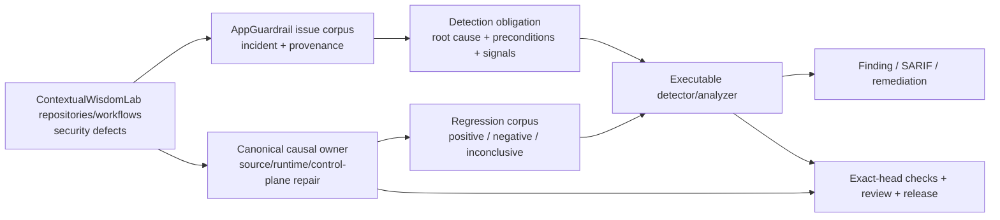

# AppGuardrail product and technical gap baseline

**Snapshot:** 2026-09-07 12:58 UTC  
**Authority:** protected `develop` documentation plus live exact-head GitHub evidence  
**Status:** working baseline; not a release, certification, or protected-branch capability claim

## Goal and evidence contract

AppGuardrail is the ContextualWisdomLab security-defect corpus and executable detection/remediation boundary. Buyer value is not a rule count: a retained incident becomes useful only when the causal failure is reproducible, its preconditions and observable signals are explicit, safe lookalikes and equivalent misses are tested, the canonical source owner is repaired when necessary, and exact-head evidence survives ordinary protected integration.

Issue text, registry rows, fixtures, predecessor checks, queued workflows, and model reviews are not detector truth. Executable scanner/analyzer evidence is authoritative. Runtime prevention and scanner detection are separate obligations. Missing, unavailable, stale, cancelled, failed, or inconclusive evidence never becomes `Clean Scan` by omission.

The development loop is:

```text
security corpus → causal owner/root cause → RED regression → smallest safe repair
→ exact-head Checks/current-head review → ordinary protected merge/release
→ protected-owner oracle refresh → next corpus item / buyer-visible Gap
```

Review, check, deployment, or release waits are non-blocking across independent safe lanes. Force push, destructive rebase, self-approval, gate weakening, warning suppression, detection bypass, stale-check reuse, and admin protection bypass are prohibited.

## PRD / TRD / architecture status

The protected PRD and `ARCHITECTURE.md` define four separable product planes:

```text
scan       built-in executable detectors + provenance-preserving external engines
remediate  deterministic safe transforms + reviewable verification guidance
control    tenant-isolated scan/history/drift/API-key/webhook behavior
assurance  SARIF, reports, SBOM, CI/release provenance and buyer evidence
```

`docs/PRD.md` remains product authority; `docs/TRD.md` records technical contracts; root `ARCHITECTURE.md` and `docs/UML.md` remain component/control-flow authorities; `docs/TRACEABILITY.md` binds defect classes to executable evidence; `docs/THREAT_MODEL.md`, `docs/TEST_STRATEGY.md`, and `docs/OPERABILITY.md` define abuse, verification and operations. This baseline does not create a competing architecture.

**UML:** existing architecture/UML material remains authoritative; detector work that changes a component boundary must update it.  
**ERD:** AppGuardrail detector fixtures and issue-corpus metadata are evidence artifacts, not a new transactional aggregate. Control-plane persistence remains the database authority; any new persisted evidence aggregate requires tenant ownership, lifecycle, retention/deletion, provenance, rollback and migration contracts before implementation.

## Context Map



Responsibility boundaries:

- **AppGuardrail** owns executable detection, normalized findings/SARIF, regression evidence, remediation and detector traceability.
- **The causal repository** owns vulnerable product/runtime behavior and must carry the source repair when AppGuardrail is not the defect owner.
- **ContextualWisdomLab/.github** owns organization CI/review/security/release control-plane behavior; leaf repositories must not copy or weaken a central control to bypass an owner defect.
- **External scanners** keep source/tool/version provenance. Normalization does not relabel their evidence as built-in AppGuardrail evidence.
- **Exact-head review/check infrastructure** is acceptance evidence, never a substitute for product truth.

## Security-defect corpus — live 2026-09-07 12:58 UTC snapshot

| Work / corpus item | Exact observed state | Root cause / reusable security meaning | Next safe action |
| --- | --- | --- | --- |
| AppGuardrail #1133, branch `feat/actions-poll-structural-analyzer-1087`, exact head `5baeab93de2a940b024dd31463ce7417ae990e3a` | open/Draft successor stacked on #1088 (`d9744331...`). REST mergeability is versus the #1088 branch, not protected `develop`. Analyzer GREEN remains `529ecb0`; `5baeab9` adds `.github/workflows/actions-poll-analyzer-coverage.yml` with concurrency `actions-poll-analyzer-coverage-{repository}-{PR number}`, fail-closed missing PR number, Coverage.py pin `4c0e7ff` (7.15.4), and exact-head checkout. Local focused+corpus suite 162 passed; analyzer 399/186 statement/branch 100.00%. Dedicated coverage run was queued on this head. ADR-0009 Status Proposed. No `_scan_file` hook. | regex adjacency windows cannot prove init-before-loop, unreachable `exit`, reversed comparisons, quoted text, or sibling-job timeouts. Additive `classify_poll_loops` records those causal facts while preserving detector IDs `github-actions-transport-only-poll-bound` and `github-actions-transport-failure-budget-poll-bound`. | keep Draft stacked on #1088. Require the new exact-head coverage job to be terminal-success before treating this slice as check-complete. Do not Close #1087 or #1088. Do not emit through `_scan_file` until a later slice proves it will not double-count the regex corpus. |
| AppGuardrail #1088 / Issue #1087, branch `sentinel/detect-transport-only-poll-bound-1087`, exact head `d9744331b83e9a47d4b0a84f1e81e42e382aa4c2` | open/Draft; mergeable but not merge-ready. RED `d50f49ccea1cbf2aecc6da268850fddfc80db3b6` is repaired by production `99bdf459cf7939896740c61c2c3fe9c222377312`; docs predecessor `e63c34279491c9c8c90764215d6ba39c8ad8d9e3` passed local polling 126/126 and hosted Tests plus six repository controls, while the full local suite had 1,126 pass / one unrelated pre-existing `src/....py` Path/String contract failure. `d9744331...` removes the narrower duplicate `docs/product-technical-gap-baseline.md` from #1088 after verifying complete carryover in canonical single-writer #999; detector/test files are unchanged. On this exact head, Tests, Security Process and four coverage workflows are terminal success; Security Scan, SAST Semgrep and CodeQL PR remain queued. No qualifying independent approval exists; 11 current review threads remain open. | verified `ContextualWisdomLab/.github` incident: a retry budget counted only transport failures, so healthy API/no-verdict iterations could retain a runner. Forward `-gt` and statically positive owning-job `${{ N }}` timeouts are now recognized without accepting reversed/non-expiring, zero/negative/dynamic, or sibling-job bounds. | keep all four detector identities and corpus as G-06 migration oracles. Stay Draft through fresh exact-head Checks/review; keep the Gap baseline only in #999 and do not Close #1087. |
| AppGuardrail #1143, branch `feat/claude-plugin-license-mismatch-1099`, exact head `e5051ea32eeedb708e3f7e04c1f25c395fc4bbbd` | open/Draft successor stacked on #1142 (`d5df6c7...`). RED then GREEN license tests; detector statement coverage 935/935 with plugin suites. REST mergeable CLEAN versus #1142. | NOTICE files count as license evidence. Conflicting SPDX identifiers across the declared license field, LICENSE, and NOTICE fail as `claude-plugin-license-mismatch` without inventing legal approval. | keep Draft stacked on #1142. Do not Close #1099 or #1142. |
| AppGuardrail #1142, branch `feat/claude-plugin-sarif-receipt-1099`, exact head `d5df6c75f97eac677527e44b9b91df41c3825dfc` | open/Draft successor stacked on live #1141 (`e9852bd...`). RED `854a21b` → GREEN `d5df6c7`. Full suite 1180 passed; `claude_plugin_sarif.py` 50/50. License-mismatch successor is #1143. | receipt `sarif_sha256` is SHA-256 of a SARIF 2.1.0 document whose rule IDs match `finding_summary`. Mutating the tree changes both. | keep Draft stacked on #1141. Do not Close #1099 or #1141. Do not invent a second SARIF dialect. |
| AppGuardrail #1141, branch `feat/claude-plugin-catalog-bind-1099`, exact head `e9852bdb9025f3873dbafed9e0381a1798a41b5a` | open/Draft successor stacked on #1140 (`bfa61c9...`). Live head adds canonical marketplace entry selection by plugin name after `80f56b0`. REST mergeable CLEAN versus #1140. SARIF-receipt successor is #1142. | an external marketplace catalog binds `catalog_repository`, `catalog_commit_sha`, and `marketplace_blob_sha`. A floating catalog commit reuses `claude-plugin-floating-git-ref`. Catalog plugin name/repo/ref that disagrees with the retrieved artifact reuses `claude-plugin-source-mismatch`. | keep Draft stacked on #1140. Do not Close #1099 or #1140. Do not fork the receipt schema. |
| AppGuardrail #1140, branch `feat/claude-plugin-scan-cli-1099`, exact head `bfa61c95f8b7126cea316ecc95d558dbcc875e8d` | open/Draft successor stacked on #1139 (`6cd54b3...`). RED `192ae4f` → GREEN `bfa61c9`. CLI tests plus plugin suite 88 passed; new `claude_plugin_scan_cli.py` 79/79; detector gate 1194/1194. Catalog-bind successor is #1141. | `appguardrail scan-plugin --plugin-root` writes the existing deterministic receipt. Exit 0 only when `scan_result` is pass. Missing root fails closed. Pass is not Noema admission. | keep Draft stacked on #1139. Do not Close #1099 or #1139. Do not fork the receipt schema. |
| AppGuardrail #1139, branch `feat/claude-plugin-skill-rule-reuse-1099`, exact head `6cd54b3ec49b085cfd8d3584746f600162d0e1d5` | open/Draft successor stacked on #1138 (`bdb3809...`). Non-destructive merge of #1036 `fdb49c3` plus adapter. Local 74 plugin tests; statement coverage 872/872. REST mergeable CLEAN versus #1138. CLI successor is #1140. | plugin skill/agent surfaces reuse released #1036 identities (`skill-name-homoglyph-confusable`, `skill-manifest-prompt-injection-payload`, `skill-doc-exfiltration-endpoint-directive`, `skill-placeholder-template-unresolved`). The adapter calls the packaged YAML engine and does not copy those regular expressions. ASCII skills still pass; README homoglyphs and skill symlinks are not surfaces. | keep Draft stacked on #1138. Do not Close #1036, #1099, or #1138. |
| AppGuardrail #1138, branch `feat/claude-plugin-unsigned-download-1099`, exact head `bdb380938b33bd9918eafc433ff3081964bd36a4` | open/Draft successor stacked on #1137 (`78c486f...`). RED `e4efb66` → GREEN `bdb3809`. Focused plugin tests 67 passed; `claude_plugin_detector.py` statement coverage 1150/1150. Skill-rule-reuse successor is #1139. | mutable runtime download then execute, and unpinned `https://`/`git+` package installs, fail admission (`claude-plugin-unsigned-executable-download`, `claude-plugin-unpinned-package-install`). Lockfile-backed package trees without postinstall download stay `package_install` inventory. | keep Draft stacked on #1137. Do not Close #1099 or #1137. Do not treat every shell command as malicious. |
| AppGuardrail #1137, branch `feat/claude-plugin-github-docker-authority-1099`, exact head `78c486f4a87c0af19cfa0012d21b5dc27df81f43` | open/Draft successor stacked on restacked #1136 (`32dc0fc...`). Unique TDD item 7: GitHub write tokens, Docker sockets, secret-to-network. Local 61 plugin tests; statement coverage 804/804. REST mergeable CLEAN versus #1136, not protected `develop`. Unsigned-download successor is #1138. | hardcoded `ghp_`/`github_pat_` tokens, `/var/run/docker.sock` / `unix://...docker.sock`, and named secrets copied into curl/wget/fetch fail admission. `gh issue create` and `docker push` remain inventory evidence. Detector snippets keep prefixes/env names; CLI redacts token/secret rule snippets. | keep Draft stacked on #1136. Do not Close #1099, #1036, or #1136. Do not reimplement #1036. |
| AppGuardrail #1136, branch `feat/claude-plugin-receipt-replay-1099`, exact head `32dc0fc81a900c0d829ecfe1fd0a064a32401b95` | open/Draft successor restacked non-force onto live #1135 (`ef28b05...`) after the #998 public-message restack. Unique stale/mismatched receipt replay is preserved. Focused plugin + public-message tests 53 passed on the merge. | a pass receipt is not Noema admission. `verify_plugin_scan_receipt` fails closed on artifact/policy/catalog/source/marketplace digest mismatch and on replay against mutated trees. | keep Draft stacked on #1135. Unique GitHub-write/Docker successor is #1137. Do not Close #1099 or #1135. |
| AppGuardrail #1135, branch `feat/claude-plugin-archive-submodule-1099`, exact head `ef28b05343739aa94ee2f2b942d363de52a1fdec` | open/Draft successor stacked on #1134 after non-force restack onto #998 `8b95c2b`. Receipt-replay successor is #1136 at `32dc0fc`. | zip/tar members that escape the extract root are not followed (`claude-plugin-archive-path-traversal`). Nested `.gitmodules`/gitlink without a recursively admitted 40-character SHA fail admission (`claude-plugin-unadmitted-submodule`). | keep Draft stacked on #1134. Do not Close #1099, #1134, or #1129. Do not extract outside the bounded root. |
| AppGuardrail #1134, branch `feat/claude-plugin-capability-inventory-1099`, exact head `36e8f37bc67392dd04ace4df8dbcdceed371e097` | open/Draft successor stacked on #1129 `c5be73c` after non-force restack. Archive successor #1135 is at `ef28b05`. | inventory is evidence, not permission. Undeclared executables after manifest inventory fail admission (`claude-plugin-undeclared-executable`). Receipt `capability_inventory_sha256` is a sorted-key digest. | keep Draft stacked on #1129. Do not Close #1099, #1129, or #1036. |
| AppGuardrail #1129, branch `security/cwl-issue-detector-families`, exact head `c5be73c52a78a1c63c6ddf212de7d6281b9bd96b` | open/Draft successor stacked on #998 `8b95c2b`. Unique head is a non-force merge of the public-message contract repair onto `24c6dda` lineage. Capability inventory successor #1134 is at `36e8f37`; archive/submodule successor #1135 is restacked at `ef28b05`. | frozen CWL security issues cluster into SAST/DAST families. Catalog SHA/repo/path must bind to the retrieved tree. | keep canonical owners #1088, #966, #1133, #1134, #1135, #1136, #1137, #1138, and #1139. Do not Close #1087, #929, #983, or #1106. |
| AppGuardrail #966, branch `feat/actions-orphan-workflow-evidence-929`, exact head `f70728908df37302a186923cf2a5bf6414a1fbb0` | open/non-Draft. Compare to `develop@e71d37e` is `ahead 16` / `behind 0`, so BEHIND is resolved. REST `mergeable_state=blocked`. GitHub `reviewDecision` remains `CHANGES_REQUESTED` from predecessor OpenCode reviews on `b3f10addb8450107f2425de01ae3ac4f9a3a9423` and `5db368604107c8c9bef2996ce36d1e4fa6ac9ddc`. The recorded origin of that predecessor blockage is Noema HTTP 502; current-head Required Noema run `34081194967` and OpenCode run `34081194977` remain queued, so there is no current-head 502 conclusion. Relates to #929 and does not auto-close it. | read-only source-bound detector for Actions workflow registry identities that are active in GitHub but absent from the exact default-branch tree. Name hints never substitute for source-path evidence. | repair the predecessor OpenCode `CHANGES_REQUESTED` / Noema 502 blockage; do not Close #929. Trusted-operator disablement of confirmed orphans remains a post-integration operational exit condition. |
| AppGuardrail #998 / Issue #983, branch `security/python-shell-ast-983`, exact head `8b95c2bee24567ab3200a96da807259e023eee73` | open/Draft; REST mergeable but `mergeStateStatus=BLOCKED`; stale OpenCode `CHANGES_REQUESTED` on `e2b0637`. Current-head Tests 3.11/3.13 SUCCESS; Python shell AST coverage SUCCESS; Semgrep, osv-scan, Security Process, coverage gates, CodeRabbit SUCCESS; current-head Noema review SUCCESS at 12:40 UTC. Strix `strix` is in progress. OpenCode `opencode-review` remains queued. CodeQL compatibility analysis python/actions FAILURE is the designed pending-handoff after dispatch (`CodeQL scan dispatched... rerun this exact failed CodeQL job after publishing its terminal verdict`), not a source RED (G-07). Dispatch current-head CodeQL scan remains queued. Predecessor Strix/Noema do not transfer. | regex-only `python-command-injection` missed aliased/nested/dotted bindings; AST omitted implicit-shell `getoutput`/`getstatusoutput` until `60cdd3f`; public message must name both implicit-shell families and `subprocess shell=True` distinctly. | stay Draft until current-head Tests/Strix/OpenCode/CodeQL-verdict and independent non-author approval exist. Do not Close #983. |
| `ContextualWisdomLab/.github` protected wall-clock owner repair | protected repair `e29302c05eade7da7b0bdbb453e53980bc9d577b` | adds a 10,800-second total deadline to the original polling owner and fails closed | retain as prevention/control-plane evidence and pinned fixed oracle; it does not by itself satisfy AppGuardrail scanner coverage. |
| `ContextualWisdomLab/.github` #1706, stronger event-driven runner release, latest observed head `21bf1f79a00555fe0f4be797ebac4a426a059094` | open/mergeable but Proposed/non-merge-ready; temporary source-fix work remains owner-side | stronger buyer-visible Gap: even bounded multi-hour waiting consumes required-review capacity | require durable one-shot/event reconciliation source, full-suite GREEN, temporary workflow/helper deletion and resulting exact-head central CI/security/current-head review before ordinary merge. |
| AppGuardrail #1080 / Issue #892, Bearer DNS-rebinding TOCTOU, head `0a752c091489efd4dc7373230f1e242313e7cca6` | open/mergeable; current-head review remains authoritative | preflight URL/DNS validation can diverge from the later credential-bearing connection; family tracks destination/request/credential/reachability and mutation state | finish current-head provenance/control-flow repairs; no predecessor GREEN reuse. This family is also evidence for the structural-analyzer Gap below. |
| AppGuardrail #1117, dashboard scan-history attribute injection, exact head `d3283a168446a71c9f983f14a348712cdb6e7fe5` | open/mergeable/Draft; zero unresolved review threads. All nine repository workflows except CodeQL PR are terminal success. CodeQL PR `34068384347` failed closed only after authenticated dispatch with `VERDICT_STATE=pending`; central exact-head scan runs `34072930847` and `34072932500` are queued. No qualifying independent `APPROVED` review exists. | `/api/v1/scans` history fields enter an `innerHTML` template. An unescaped scan id in a quoted `data-id` attribute could break attribute context; history and summary count fields also require numeric coercion before interpolation; #1091 proved the summary-count sink remained reachable until it was carried into #1117. The branch escapes the id, coerces counts, installs Chromium explicitly in CI, and uses a real browser regression that preserves the malicious dataset value while requiring zero injected `img` elements and zero dialogs. A concurrent update briefly removed the DOM-element oracle and restored a dead read; exact head `d3283a16...` preserves the CI delta, restores both reviewed test invariants, coerces latest/new/critical summary counts, and expands the Chromium fixture to hostile id/count/created-at/repository values. #1091 remains Draft until this successor coverage is exact-head GREEN and complete carryover is reverified. Its concurrent current head `ec9dcfb7ec6a93d5acbb093a8caa3c95b7be2b21` is ahead 2 from `25a8733d967021e275308351354280dfa18684ac`; the effective compare changes only `.jules/sentinel.md`, so no product/test XSS delta was added or removed. | keep production escaping and the realistic browser oracle unchanged. Require exact-head Tests/security/SAST/CodeQL and independent review; inspect normal/loading/empty/error/detail and keyboard/focus behavior before leaving Draft. |
| AppGuardrail #1068, empty-host / unresolved-DNS SSRF, exact head `325d48e0249b715bd33d48e45c597240dfb80a77` | open/mergeable/Draft; REST `mergeable_state=blocked`. Exact head `325d48e...` is a source-neutral empty-file descendant of `a06a96fc3f0790a3cc9ba8f73285ffe3b51fba9d` (`ahead 1` / zero changed files; commit message is a Strix timeout CI retrigger) and does not add a security delta. On this retrigger, Tests, Security Process, Pinned HTTPS, OpenSSF, scan-path and retention coverage are terminal success, while Strix, SAST Semgrep, Noema, CodeQL compatibility analysis, and some Security Scan jobs remain pending. Predecessor CodeQL pending-handoff evidence does not transfer. No qualifying independent `APPROVED` review exists. Generated duplicate #1128 at `4a76b955ecc6e767e137ac15e82b83a2af148386` was closed only after exact patch comparison proved complete carryover. | malformed/unresolved destinations previously crossed fail-open validation. The canonical lane rejects missing hosts in both validators, fails closed on `socket.gaierror`, and retains the HIGH/CWE-918 detector, vulnerable/fixed corpus, API/direct validator regressions, and FP/FN traceability. #1128's valid `http://` and `http://user@` obligations are fully preserved; its body-mentioned separate test file was absent from its current patch. | keep #1068 as the single Draft writer. Wait for current-head Strix/SAST/Noema/CodeQL and qualifying independent approval; never reuse predecessor results or recreate a duplicate hostless lane. |
| AppGuardrail #1107, webhook storage admission and detector precision, exact head `f10795e294df5b0d9797fc50b201126c998a3632` | open/mergeable/Draft. Exact-head Security Process `34077096473` exposed the local-sink detector false positive; the repaired head has nine fresh hosted workflows queued/pending. Local GREEN is 27/27 stored-SSRF tests, 37/37 SSRF/documentation tests, 1,009/1,009 repository tests, and zero deploy-blocking findings in the real repository scan. CodeGraph was unavailable locally. | the HTTP route and directly callable persistence function had duplicated validation, rejecting the documented empty-string clear value. The runtime repair makes `set_webhook` the single validation/persistence boundary. The existing `python-stored-ssrf-webhook-url` regex then reported the safe delegated route because it did not inspect the local sink body. RED `ead954ad...` fixes the FP/FN contract: one unique top-level, non-rebound sink with unconditional unsafe rejection before SQLite use is negative; unrelated conditional validation and symbol rebinding remain positive. GREEN `f18fec7c...` adds the bounded stdlib AST proof and `f10795e...` records traceability. | keep Draft; require fresh exact-head hosted checks/current review, then integrate #1068 non-destructively after its unresolved-DNS validator reaches protected `develop`. Do not treat persistence validation as delivery-time DNS pinning or weaken the #1068 prerequisite. |
| AppGuardrail #1130, Jules webhook SSRF subset, exact head `0243a1a5a1cef758b14ae85f87b2ea1dd86e9e82` | converted to Draft at 05:37 UTC. Effective delta is `set_webhook`/route plumbing, a regex `try`/`except ValueError` lookaround, and `.jules/sentinel.md`. No runtime tests and no AST FP/FN contract. Canonical owner remains #1107. | same storage-boundary SSRF class as #1107, implemented as a weaker regex-only slice | keep Draft. Do not Close until complete carryover onto #1107 is verified. Do not race #1107 to `develop`. |
| AppGuardrail #972 / Issue #927, branch `feat/scan-assurance-927`, exact head `c488cfffe4dd95a9be8b8ed99e77a86cc8d5d81f` | open/Draft. Non-force restack onto protected `develop@e71d37e` completed 05:37 UTC (`ahead` of predecessor `4ba738a...` by the merge commit only). REST `mergeable=MERGEABLE`, `mergeStateStatus=BLOCKED`. Fresh exact-head checks are in flight and do not inherit predecessor GREEN. | `0 findings` must not render as `clean` unless repository/commit identity, findings digest, detector completion, requested engines, scope, freshness, and gate accounting all verify. Ambiguous evidence is `untrusted`/`failed`/`incomplete`. | keep Draft through current-head Tests/security/SAST/CodeQL/dedicated assurance coverage and independent review. #1005 remains the report-consumer successor and must restack after this head is stable. Do not Close #927. |
| AppGuardrail #1006 / Issue #928, branch `feat/issue-928-evidence-handoff`, exact head `35c28e22b5d50f1da943718cdb1984dcee098d62` | open/non-Draft. Non-force restack onto `develop@e71d37e` completed 05:37 UTC. REST `mergeable=MERGEABLE`, `mergeStateStatus=BLOCKED`. Dashboard clipboard/UI slice remains out of scope. | transport-neutral, redacted, digest-verified remediation bundle so an agent workflow cannot copy hostile or unbounded evidence | require fresh exact-head checks after restack; keep the UI/CSP/Storybook slice as a later G-03 successor. Do not Close #928. |
| AppGuardrail #1036, shared-skill supply-chain detection, exact head `fdb49c346c2ae7d30b61f6f9a9b33bf8e9b0cf99` | open/Draft; REST mergeable but `mergeStateStatus=BLOCKED`; `reviewDecision=REVIEW_REQUIRED`; `autoMergeRequest` is null. Central OpenCode run `34069453772` reached Python 3.14 coverage and failed `test_string_path_language_detection_matches_path_objects[src/....py]`; `fdb49c3...` applies the same name-based rule to both public input forms. Predecessor checks, Noema approval, and review receipts do not transfer. Wait authenticated current-head OpenCode; do not Close. | installable skill/agent manifests can hide mixed-script identifiers, prompt-injection/exfiltration directives, or unresolved placeholders; language-axis evidence must also remain identical for equivalent `str` and `Path` inputs across supported runtimes. | retain structural-key, flow-YAML and defensive-prose FP/FN oracles; require fresh Python 3.14 Tests, security/SAST/CodeQL and current-head OpenCode/Strix/Noema review before ordinary merge. |
| AppGuardrail #1111, repository Actions queue/consolidation, exact head `77d25085b873a38c58cb55bca2300df404365a1c` | open/mergeable with ordinary squash auto-merge enabled and zero unresolved review threads; Tests and Security Process are terminal success; Security Scan, SAST, CodeQL, Strix, Noema and OpenCode remain queued/pending, with no qualifying approval present | prior candidate used unsupported `concurrency.queue: max` and suppressed actionlint, but GitHub concurrency can replace an older pending run even when the running job is not cancelled. RED contract requires release workflows to have no concurrency group; production removes both lossy blocks and the suppression while retaining exact-head cancellation only for PR validation. Current-head follow-up also rejects scalar top-level forms such as `concurrency: release-group`, closing the review-discovered contract hole. | require fresh exact-head workflow/schema evidence and independent review. Preserve every release dispatch/tag as its own run; never reintroduce an unsupported key or warning suppression. |
| AppGuardrail #963 / Issue #550, discarded tenant authorization context, head `c656fe68cc616852f51a97e456cdf4e0b54fa168` | open/mergeable | tenant-admin authorization can be checked while returned tenant context is discarded before global reads or tenant-sensitive mutation | keep detector oracle pinned separately from live causal-owner candidate; refresh fixed oracle only after owner protected merge. |
| `ContextualWisdomLab/clearfolio` #541, causal owner for #550, live head `917b97d153196920da76f9ba4f0df761fdf7a4ac` | open/mergeable; descendant of non-destructive security restoration `1337efe45640740b338d021d64e41c045ecf7201` | concurrent `020c0ec...` reintroduced global/controller-local tenant filtering and keyless SHA-256 retry identity while deleting application/repository/HMAC contracts; restoration preserved history while reinstating tenant-scoped ports and keyed/domain-separated HMAC | require owner exact-head CI/security/review and protected merge; then update AppGuardrail #963 protected fixed-source oracle. |
| Issue #309, `naruon` OpenSSF Best Practices badge | open LOW governance/posture; no code location or reproducible source→sink path | security-program maturity signal, not an application vulnerability | do not manufacture a HIGH source detector; track as governance evidence. |
| Closed #310/#311, Code Scanning analysis-category visibility | closed configuration/assurance findings | GitHub could not compare current analysis categories with protected branch | retain as assurance/configuration corpus; only add detector logic when executable category/provenance drift evidence exists. |

Open `security` labels are not the whole corpus. Closed incidents, source-side fixes, review-discovered FP/FN boundaries, exact failed logs, and authenticated workflow evidence remain regression inputs when they encode a reproducible security failure class.

## Detector-development contract

Every retained security defect must record:

1. **Root cause** — security-relevant state transition or missing enforcement, never title/string identity.
2. **Preconditions** — data/control-flow, configuration, dependency, permission, secret, workflow and environment conditions.
3. **Observable signals** — evidence AppGuardrail can acquire independently.
4. **False-positive boundary** — safe lookalikes, including runtime/shell/protocol semantics that make textual similarity non-causal.
5. **False-negative boundary** — equivalent syntax/control-flow not yet modeled.
6. **Causal owner** — AppGuardrail, product repository/runtime, or `.github` control plane.
7. **Regression evidence** — historical vulnerable incident plus fixed/negative/inconclusive oracle.
8. **Acceptance evidence** — unchanged exact-head tests/security checks, current-head review, protected merge, immutable owner release and consumer bump where a released owner contract is involved.

Where regex families need path reachability, mutable state, shell semantics, or increasingly incompatible adjacency exceptions, stop treating another regular expression as the default answer. Preserve existing rule IDs and corpus as migration oracles and move the shared causal state into an executable structural analyzer.

## Buyer-visible Gap register

| ID | Buyer-visible Gap | Current evidence | Smallest valuable slice | Exit evidence | Status |
| --- | --- | --- | --- | --- | --- |
| G-01 | A buyer cannot always prove AppGuardrail observed the authoritative source condition instead of trusting a caller assertion. | PRD detector authority plus source-backed security PRs | one end-to-end source identity → executable assessment → immutable evidence/report slice | positive/negative/malformed/unavailable/stale/adversarial cases; exact source digest and black-box production path | **In progress** |
| G-02 | `0 findings` can overstate assurance when detectors/tools/scope/provenance are incomplete. | PRD typed evidence contract; Draft #972 exact head `c488cfffe4dd95a9be8b8ed99e77a86cc8d5d81f` after non-force restack onto `develop@e71d37e`. Core module `appguardrail_core.scan_assurance` already encodes `clean`/`findings_present`/`incomplete`/`failed`/`untrusted`. Dashboard/SARIF/report/gate consumers remain #1005 / later slices. | keep the standalone contract on #972 through current-head checks; then consume it from report/dashboard without copying scanner authority | dashboard/JSON/SARIF/report/gate agree; missing evidence never renders clean | **In progress / active in #972** |
| G-03 | A developer cannot safely transfer remediation/evidence into an agent workflow without CSP, clipboard, redaction, or provenance ambiguity. | Issue #928 remains open; PR #1006 at exact head `35c28e22b5d50f1da943718cdb1984dcee098d62` after non-force restack onto `develop@e71d37e` is active-PR evidence for a transport-neutral, deterministic, redacted and digest-verified JSON contract, while the dashboard UI slice remains explicitly separate. | retain the standalone versioned bundle boundary; then add CSP-safe listener-based copy actions, accessible fallback/live-region behavior, focus handling and browser E2E after the design/Storybook gate | hostile text remains inert; no duplicate listeners; exact success/rejection/fallback behavior; provenance schema and digest verified on an unchanged protected head | **Open / active in #1006** |
| G-04 | Enterprise buyers need defensible retention/deletion/audit/recovery for scan evidence. | control-plane schema and retention/audit work | tenant-owned retention/audit policy integrated into live store/API | migration rollback, backup/restore, authorization, immutable audit and release evidence | **Open** |
| G-05 | Acquisition reviewers lack one compact exact-head source/check/provenance/causal-repair package. | OPERABILITY/assurance contracts; evidence distributed | deterministic buyer-evidence package bound to SHA/run/artifact/release | recomputable digest, no raw secrets, failed vs unavailable distinction, protected-head smoke proof | **Open** |
| G-06 | Stateful regex detector families alternate between FP and FN repairs as control-flow/provenance complexity grows. | #1088 remains the regex corpus owner at `d9744331...`. Draft successor #1133 `5baeab9` stacks `classify_poll_loops`, ADR-0009 Proposed, and a dedicated PR-number-bound coverage workflow. Local 162 tests / 100% analyzer coverage; hosted exact-head coverage was queued, not yet GREEN. Production `_scan_file` is intentionally unhooked. #1129 maps the family and must not Close #1087/#929. | keep the analyzer additive through exact-head coverage GREEN and review on #1133; add an emission hook only after it is proven not to double-count regex findings; apply the same pattern to #1080 only after that provenance model is stable | differential corpus against current rules; all historical positives retained; safe negatives stay negative; comparison direction, timeout ownership/static positivity, branch reachability, unreachable control transfers, command-vs-quoted text, declaration order, selected shell/fail-fast state, independent total bounds, and realistic performance measured | **In progress / active in #1133 stacked on #1088** |
| G-07 | Shared required-review/security capacity can be consumed by wait loops even after the original transport-only defect is bounded. | protected `.github` wall-clock repair plus Proposed #1706 event-driven one-shot work; `.github#712` remains the canonical queue/startup RCA and includes AppGuardrail exact-head zero-job CodeQL canary `33640116203` | canonical `.github` one-shot admission + exact-run/event reconciliation, no repository-authored polling/model timeout | RED prerequisite→production GREEN; no real sleeps; exact PR/head/run validation; temporary source-fix machinery deleted; full central suite and required security/review GREEN | **Proposed / active owner prerequisite** |
| G-08 | This baseline can become stale while the security corpus changes rapidly. | PR #999 is the single writer; snapshot 2026-09-07 12:58 UTC records Draft #1143 `e5051ea` stacked on #1142 `d5df6c7` on #1141 `e9852bd` on #1140 `bfa61c9` … on #998 `8b95c2b`; G-06 remains #1133 with coverage queued. | refresh from live exact heads while never claiming open candidates as protected behavior | protected merge of current snapshot; subsequent material changes produce another explicit snapshot | **In progress in #999** |

## Technical / TRD gaps

- Built-in regex rules are valid only for explicitly tested syntax/control-flow. Structural semantics not safely representable must move to an executable analyzer or remain an explicit gap.
- GitHub Actions polling analysis must distinguish per-request transport budgets from total control-flow bounds, preserve job/run/loop locality, model branch and exit reachability, distinguish executable commands from quoted/comment text, and account for selected shell/fail-fast semantics before using shell errors as safety or vulnerability evidence.
- Safety state is causal, not nominal: initialization must precede the candidate loop; deadlines/limits/counters must converge; state in sibling/earlier loops cannot sanitize another loop; textual `exit` is not safety evidence when a prior unconditional transfer makes it unreachable; an independent monotonic total bound must remain authoritative even if a non-owning retry counter resets.
- URL-validation tests that prove a public resolved hostname must control DNS deterministically. Reserved/example hostnames are not evidence that production should accept unresolved destinations.
- Missing/queued/failed/stale/cancelled/unavailable evidence are distinct typed states. A required workflow `startup_failure` with zero jobs is control-plane/infrastructure evidence, not a source-test success or failure and never transfers from another head.
- AppGuardrail is security tooling, not mathematical-science code. Rust/native work requires measured isolation/performance justification and a versioned boundary rather than language preference alone.
- Any future database changes use normalized tenant ownership, descriptive identifiers, migration rollback and measured locking/partition strategy; this document introduces no schema.

## Governance and next actions

```text
re-fetch docs/issues/PRs/current heads
→ inspect reviews, unresolved threads and exact logs
→ RED regression on canonical writer
→ smallest causal repair
→ fresh exact-head Checks
→ continue another independent safe lane while waiting
→ ordinary protected merge/release only when current evidence is satisfied
→ refresh owner oracle + corpus + this baseline
```

1. Continue #1088 from exact head `d9744331...`, a docs-only single-writer cleanup after `99bdf459...` repaired strict `-gt` bounds and constant timeout expressions. Six repository workflows are terminal success while Security Scan, SAST Semgrep and CodeQL PR remain queued; stay Draft and do not transfer `e63c342...` evidence. Keep `docs/product-technical-gap-baseline.md` solely on #999. Do not Close #1087.
2. Treat #1088's repeated regex-state divergence—including unreachable exits, independent total bounds, command-substitution tokenization and conditional-block ownership—as migration oracles for G-06 structural GitHub Actions/shell analysis rather than continuing unlimited regex growth.
3. Keep #1068 on source-neutral exact head `325d48e0249b715bd33d48e45c597240dfb80a77` as the single Draft hostless/unresolved-DNS lane. The head is an empty-file descendant of `a06a96fc...`; repository Tests/coverage/Security Process are GREEN on this retrigger while Strix/SAST/Noema/CodeQL-compat remain pending; no independent approval exists; #1128 is retired only by verified complete carryover.
4. Keep exact-head `startup_failure` with zero jobs classified as central control-plane evidence. `ContextualWisdomLab/.github#712` owns the current queue/startup RCA; do not churn leaf source or reuse predecessor GREEN.
5. Keep #1036 Draft on exact head `fdb49c346c2ae7d30b61f6f9a9b33bf8e9b0cf99`. Auto-merge is absent; `reviewDecision=REVIEW_REQUIRED`. Wait authenticated current-head OpenCode/Strix/Noema; do not Close and do not transfer predecessor approval.
6. Keep #1080, #1068, #1036 and #963 exact-head evidence independent; predecessor success never transfers.
7. Keep `ContextualWisdomLab/clearfolio` #541 owner evidence separate from AppGuardrail #963 detector maturity until protected owner merge.
8. Refresh this baseline after material exact-head changes, protected merges/releases, new reproducible security classes, or PRD/ADR/ARCHITECTURE boundary changes.
9. Keep #1117 at exact head `d3283a168446a71c9f983f14a348712cdb6e7fe5` in Draft until the Chromium injection oracle and all exact-head security workflows are GREEN and a qualifying independent review exists; do not substitute static escaping inspection for the browser DOM contract.
10. Keep #998 Draft at `8b95c2b` until current-head Tests/Strix/OpenCode/CodeQL-verdict are terminal-success. Tests, AST coverage, Semgrep, and current-head Noema are SUCCESS; Strix is in progress; OpenCode remains queued. CodeQL compatibility FAILURE is G-07 pending-handoff after dispatch, not a source RED. Do not Close #983.
11. Keep #966 at `f707289` as the canonical orphan-detector owner. BEHIND is resolved; BLOCKED remains on predecessor OpenCode `CHANGES_REQUESTED` / recorded Noema 502. Relates to #929 and must not Close it.
12. Keep #1129 Draft stacked on #998 at `c5be73c`. Unique delta remains #1099/#1106. #1134 is at `36e8f37` and #1135 at `ef28b05` after non-force restack. Do not Close #1087, #929, #983, or #1106.
13. Keep #972 Draft at restacked `c488cff` as the G-02 assurance-envelope owner. Fresh exact-head checks after the non-force restack do not inherit predecessor GREEN. Do not Close #927.
14. Keep #1006 at restacked `35c28e22` as the G-03 bundle owner. The dashboard/CSP/Storybook slice stays a later successor. Do not Close #928.
15. Keep #1130 Draft. Canonical webhook storage-boundary owner is #1107; this Jules slice is not merge-ready.
16. Keep #1133 Draft stacked on #1088 at `5baeab9`. Wait for `actions-poll-analyzer-coverage` exact-head GREEN. ADR-0009 is Proposed. Preserve regex rule IDs and corpus. Do not hook `_scan_file` on this slice. Do not Close #1087 or #1088.
17. Keep #1134 Draft stacked on #1129 at `36e8f37`. Capability inventory is evidence, not permission. Do not Close #1099 or #1129. Do not reimplement #1036.
18. Keep #1135 Draft stacked on #1134 at `ef28b05`. Archive traversal and unadmitted submodules fail closed. Do not Close #1099, #1134, or #1129.
19. Keep #1136 Draft stacked on #1135 at `32dc0fc`. Stale/mismatched receipt replay fails closed. Do not Close #1099 or #1135. `scan_result=pass` is not Noema admission.
20. Keep #1137 Draft stacked on #1136 at `78c486f`. GitHub write tokens, Docker sockets, and secret-to-network flows fail admission; `gh issue create` and `docker push` stay inventory. Do not Close #1099, #1036, or #1136.
21. Keep #1138 Draft stacked on #1137 at `bdb3809`. Unsigned executable downloads and unpinned URL installs fail admission; lockfile-only package trees stay inventory. Do not Close #1099 or #1137.
22. Keep #1139 Draft stacked on #1138 at `6cd54b3`. Reuse released #1036 skill-supply-chain identities on plugin skill/agent receipts. Do not Close #1036, #1099, or #1138. Do not copy those regular expressions.
23. Keep #1140 Draft stacked on #1139 at `bfa61c9`. `scan-plugin` writes the existing receipt and fails closed when `scan_result` is not pass. Do not Close #1099 or #1139. Pass is not Noema admission.
24. Keep #1141 Draft stacked on #1140 at `e9852bd`. External marketplace catalogs bind catalog repository/SHA/blob digest; floating commits and source mismatches fail closed. Do not Close #1099 or #1140.
25. Keep #1142 Draft stacked on #1141 at `d5df6c7`. Receipt `sarif_sha256` must match `finding_summary` rule IDs. Do not Close #1099 or #1141.
26. Keep #1143 Draft stacked on #1142 at `e5051ea`. LICENSE/NOTICE SPDX mismatches fail closed; NOTICE-only is not absence. Do not Close #1099 or #1142.

## Standards and acceptance basis

These references guide control design; they are not a claim of CSAP, SOC 2, or another certification.

National Institute of Standards and Technology. (2022). *Secure software development framework (SSDF) version 1.1: Recommendations for mitigating the risk of software vulnerabilities* (NIST Special Publication 800-218). https://doi.org/10.6028/NIST.SP.800-218

OWASP Foundation. (2025). *OWASP Application Security Verification Standard (ASVS) 5.0.0*. https://owasp.org/www-project-application-security-verification-standard/

SLSA. (n.d.). *SLSA specification version 1.2*. Retrieved September 2, 2026, from https://slsa.dev/spec/v1.2/
