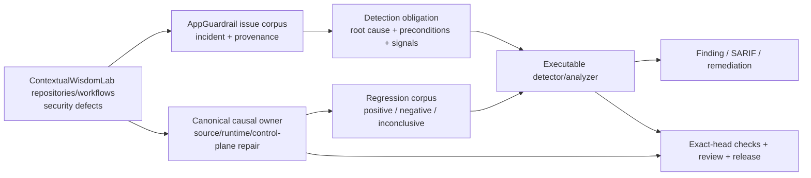

# AppGuardrail product and technical gap baseline

**Snapshot:** 2026-09-07 04:00 UTC  
**Authority:** protected `develop` documentation plus live exact-head GitHub evidence  
**Status:** working baseline; not a release, certification, or protected-branch capability claim

## Goal and evidence contract

AppGuardrail is the ContextualWisdomLab security-defect corpus and executable detection/remediation boundary. Buyer value is not a rule count: a retained incident becomes useful only when the causal failure is reproducible, its preconditions and observable signals are explicit, safe lookalikes and equivalent misses are tested, the canonical source owner is repaired when necessary, and exact-head evidence survives ordinary protected integration.

Issue text, registry rows, fixtures, predecessor checks, queued workflows, and model reviews are not detector truth. Executable scanner/analyzer evidence is authoritative. Runtime prevention and scanner detection are separate obligations. Missing, unavailable, stale, cancelled, failed, or inconclusive evidence never becomes `Clean Scan` by omission.

The development loop is:

```text
security corpus → causal owner/root cause → RED regression → smallest safe repair
→ exact-head Checks/current-head review → ordinary protected merge/release
→ protected-owner oracle refresh → next corpus item / buyer-visible Gap
```

Review, check, deployment, or release waits are non-blocking across independent safe lanes. Force push, destructive rebase, self-approval, gate weakening, warning suppression, detection bypass, stale-check reuse, and admin protection bypass are prohibited.

## PRD / TRD / architecture status

The protected PRD and `ARCHITECTURE.md` define four separable product planes:

```text
scan       built-in executable detectors + provenance-preserving external engines
remediate  deterministic safe transforms + reviewable verification guidance
control    tenant-isolated scan/history/drift/API-key/webhook behavior
assurance  SARIF, reports, SBOM, CI/release provenance and buyer evidence
```

`docs/PRD.md` remains product authority; `docs/TRD.md` records technical contracts; root `ARCHITECTURE.md` and `docs/UML.md` remain component/control-flow authorities; `docs/TRACEABILITY.md` binds defect classes to executable evidence; `docs/THREAT_MODEL.md`, `docs/TEST_STRATEGY.md`, and `docs/OPERABILITY.md` define abuse, verification and operations. This baseline does not create a competing architecture.

**UML:** existing architecture/UML material remains authoritative; detector work that changes a component boundary must update it.  
**ERD:** AppGuardrail detector fixtures and issue-corpus metadata are evidence artifacts, not a new transactional aggregate. Control-plane persistence remains the database authority; any new persisted evidence aggregate requires tenant ownership, lifecycle, retention/deletion, provenance, rollback and migration contracts before implementation.

## Context Map



Responsibility boundaries:

- **AppGuardrail** owns executable detection, normalized findings/SARIF, regression evidence, remediation and detector traceability.
- **The causal repository** owns vulnerable product/runtime behavior and must carry the source repair when AppGuardrail is not the defect owner.
- **ContextualWisdomLab/.github** owns organization CI/review/security/release control-plane behavior; leaf repositories must not copy or weaken a central control to bypass an owner defect.
- **External scanners** keep source/tool/version provenance. Normalization does not relabel their evidence as built-in AppGuardrail evidence.
- **Exact-head review/check infrastructure** is acceptance evidence, never a substitute for product truth.

## Security-defect corpus — live 2026-09-07 04:00 UTC snapshot

| Work / corpus item | Exact observed state | Root cause / reusable security meaning | Next safe action |
| --- | --- | --- | --- |
| AppGuardrail #1088 / Issue #1087, branch `sentinel/detect-transport-only-poll-bound-1087`, exact head `b34670b8130f1857a8e53e6baf7cd5933826da29` | open/mergeable/Draft; REST `mergeable_state=blocked`; explicitly not merge-ready. Do not Close #1087. RED `d50f49ccea1cbf2aecc6da268850fddfc80db3b6` pins two unimplemented detector-precision contracts: forward `-gt` finite total guards and statically positive owning-job `${{ 20 }}` timeout expressions. CodeQL PR `33682765699` is `startup_failure` with zero jobs; predecessor queued Tests/security/SAST/coverage/OSV/Scorecard lanes are not current GREEN. G-06 owns the structural GitHub Actions + shell analyzer Gap. | verified `ContextualWisdomLab/.github` required-review incident: a retry budget counted only transport failures, so healthy API/no-verdict iterations could hold a runner indefinitely relative to repository control flow. Current FP boundaries require forward finite total-attempt/deadline comparisons and statically provable positive expression timeouts without treating reversed comparisons, dynamic/zero/negative expressions, or sibling-job timeouts as safety. | keep all four detector identities and current corpus as G-06 migration oracles. Implement the two RED contracts before returning from Draft; require fresh exact-head Checks and review, and never transfer predecessor evidence. |
| CWL successor branch `security/cwl-issue-detector-families`, local commit `acc3abc1f8302be80dc82b72121b1cde7b0e2b05` | no GitHub PR; not stacked on current #998 head `f0786f6`. The unique commit is missing the `develop@e71d37e` merge and dotted-import lock. Commit text and ADR-0007 Status Proposed say this branch must not Close #1087 or #929. | frozen CWL security issues cluster into SAST/DAST families rather than one detector per ticket. Overlapping poll-bound and orphan-registry files are restack delta only. | keep canonical owners #1088 (poll bounds) and #966 (orphans). Successor unique delta is Issue #1099 Claude plugin/marketplace detector, Issue #1106 password-indirection precision lock, and ADR-0007 Status Proposed. Restack only after those owners land; never Close #1087/#929 from this branch. |
| AppGuardrail #966, branch `feat/actions-orphan-workflow-evidence-929`, exact head `f70728908df37302a186923cf2a5bf6414a1fbb0` | open/non-Draft; REST `mergeable_state=blocked` after a non-force update-branch onto `develop@e71d37e`. Repository Tests, Security Process, coverage, and CodeQL analyze jobs have current-head passes while required Noema/OpenCode/SAST/Security Scan/Strix/CodeQL PR remain queued. OpenCode `CHANGES_REQUESTED` exists only on predecessor SHAs `b3f10addb8450107f2425de01ae3ac4f9a3a9423` and `5db368604107c8c9bef2996ce36d1e4fa6ac9ddc` and is infrastructure-derived; no current-head Noema review object exists. GitHub `reviewDecision` remains `CHANGES_REQUESTED`. Relates to #929 and does not auto-close it. | read-only source-bound detector for Actions workflow registry identities that are active in GitHub but absent from the exact default-branch tree. Name hints never substitute for source-path evidence. | repair the infrastructure-derived review/check blockage; do not Close #929. Trusted-operator disablement of confirmed orphans remains a post-integration operational exit condition. |
| AppGuardrail #998 / Issue #983, branch `security/python-shell-ast-983`, exact head `f0786f6ab419746619afad296532a2922881180f` | open/Draft; REST `mergeable_state=blocked` after a non-force merge of `develop@e71d37e` plus `test(sast)` dotted-import lock `f0786f6`. All four CodeRabbit threads are resolved. Stale OpenCode `CHANGES_REQUESTED` on `e2b06378352260960e6b1038e139ee7e0a33217a` is not current-head; GitHub `reviewDecision` still shows that predecessor robot review. Robot reviews are not GitHub `APPROVE`. Latest exact-head rerun has Tests 3.11/3.13 passing while required Noema/OpenCode/SAST/Security Scan/Strix/CodeQL PR remain queued/pending, so current-head gates are not terminal-success. | regex-only `python-command-injection` could not resolve aliased, nested, or dotted `os`/`subprocess` shell bindings and treated comments/strings as executable calls. | stay Draft until current-head quality/security/SAST/coverage/semantic-review gates are terminal-success and a qualifying independent non-author approval exists. Do not treat CodeRabbit success, Devin skip, or stale OpenCode `CHANGES_REQUESTED` as merge authority. Do not Close #983 from this snapshot. |
| `ContextualWisdomLab/.github` protected wall-clock owner repair | protected repair `e29302c05eade7da7b0bdbb453e53980bc9d577b` | adds a 10,800-second total deadline to the original polling owner and fails closed | retain as prevention/control-plane evidence and pinned fixed oracle; it does not by itself satisfy AppGuardrail scanner coverage. |
| `ContextualWisdomLab/.github` #1706, stronger event-driven runner release, latest observed head `21bf1f79a00555fe0f4be797ebac4a426a059094` | open/mergeable but Proposed/non-merge-ready; temporary source-fix work remains owner-side | stronger buyer-visible Gap: even bounded multi-hour waiting consumes required-review capacity | require durable one-shot/event reconciliation source, full-suite GREEN, temporary workflow/helper deletion and resulting exact-head central CI/security/current-head review before ordinary merge. |
| AppGuardrail #1080 / Issue #892, Bearer DNS-rebinding TOCTOU, head `0a752c091489efd4dc7373230f1e242313e7cca6` | open/mergeable; current-head review remains authoritative | preflight URL/DNS validation can diverge from the later credential-bearing connection; family tracks destination/request/credential/reachability and mutation state | finish current-head provenance/control-flow repairs; no predecessor GREEN reuse. This family is also evidence for the structural-analyzer Gap below. |
| AppGuardrail #1117, dashboard scan-history attribute injection, exact head `d3283a168446a71c9f983f14a348712cdb6e7fe5` | open/mergeable/Draft; zero unresolved review threads. All nine repository workflows except CodeQL PR are terminal success. CodeQL PR `34068384347` failed closed only after authenticated dispatch with `VERDICT_STATE=pending`; central exact-head scan runs `34072930847` and `34072932500` are queued. No qualifying independent `APPROVED` review exists. | `/api/v1/scans` history fields enter an `innerHTML` template. An unescaped scan id in a quoted `data-id` attribute could break attribute context; history and summary count fields also require numeric coercion before interpolation; #1091 proved the summary-count sink remained reachable until it was carried into #1117. The branch escapes the id, coerces counts, installs Chromium explicitly in CI, and uses a real browser regression that preserves the malicious dataset value while requiring zero injected `img` elements and zero dialogs. A concurrent update briefly removed the DOM-element oracle and restored a dead read; exact head `d3283a16...` preserves the CI delta, restores both reviewed test invariants, coerces latest/new/critical summary counts, and expands the Chromium fixture to hostile id/count/created-at/repository values. #1091 remains Draft until this successor coverage is exact-head GREEN and complete carryover is reverified. Its concurrent current head `ec9dcfb7ec6a93d5acbb093a8caa3c95b7be2b21` is ahead 2 from `25a8733d967021e275308351354280dfa18684ac`; the effective compare changes only `.jules/sentinel.md`, so no product/test XSS delta was added or removed. | keep production escaping and the realistic browser oracle unchanged. Require exact-head Tests/security/SAST/CodeQL and independent review; inspect normal/loading/empty/error/detail and keyboard/focus behavior before leaving Draft. |
| AppGuardrail #1068, empty-host / unresolved-DNS SSRF, exact head `325d48e0249b715bd33d48e45c597240dfb80a77` | open/mergeable/Draft; REST `mergeable_state=blocked`. Exact head `325d48e...` is a source-neutral empty-file descendant of `a06a96fc3f0790a3cc9ba8f73285ffe3b51fba9d` (`ahead 1` / zero changed files; commit message is a Strix timeout CI retrigger) and does not add a security delta. On this retrigger, Tests, Security Process, Pinned HTTPS, OpenSSF, scan-path and retention coverage are terminal success, while Strix, SAST Semgrep, Noema, CodeQL compatibility analysis, and some Security Scan jobs remain pending. Predecessor CodeQL pending-handoff evidence does not transfer. No qualifying independent `APPROVED` review exists. Generated duplicate #1128 at `4a76b955ecc6e767e137ac15e82b83a2af148386` was closed only after exact patch comparison proved complete carryover. | malformed/unresolved destinations previously crossed fail-open validation. The canonical lane rejects missing hosts in both validators, fails closed on `socket.gaierror`, and retains the HIGH/CWE-918 detector, vulnerable/fixed corpus, API/direct validator regressions, and FP/FN traceability. #1128's valid `http://` and `http://user@` obligations are fully preserved; its body-mentioned separate test file was absent from its current patch. | keep #1068 as the single Draft writer. Wait for current-head Strix/SAST/Noema/CodeQL and qualifying independent approval; never reuse predecessor results or recreate a duplicate hostless lane. |
| AppGuardrail #1107, webhook storage admission and detector precision, exact head `f10795e294df5b0d9797fc50b201126c998a3632` | open/mergeable/Draft. Exact-head Security Process `34077096473` exposed the local-sink detector false positive; the repaired head has nine fresh hosted workflows queued/pending. Local GREEN is 27/27 stored-SSRF tests, 37/37 SSRF/documentation tests, 1,009/1,009 repository tests, and zero deploy-blocking findings in the real repository scan. CodeGraph was unavailable locally. | the HTTP route and directly callable persistence function had duplicated validation, rejecting the documented empty-string clear value. The runtime repair makes `set_webhook` the single validation/persistence boundary. The existing `python-stored-ssrf-webhook-url` regex then reported the safe delegated route because it did not inspect the local sink body. RED `ead954ad...` fixes the FP/FN contract: one unique top-level, non-rebound sink with unconditional unsafe rejection before SQLite use is negative; unrelated conditional validation and symbol rebinding remain positive. GREEN `f18fec7c...` adds the bounded stdlib AST proof and `f10795e...` records traceability. | keep Draft; require fresh exact-head hosted checks/current review, then integrate #1068 non-destructively after its unresolved-DNS validator reaches protected `develop`. Do not treat persistence validation as delivery-time DNS pinning or weaken the #1068 prerequisite. |
| AppGuardrail #1036, shared-skill supply-chain detection, head `661d5138f1d6db5db0890b7c6ca14042440d6264` | open/mergeable; REST `mergeable_state=blocked`. Eight repository-owned exact-head workflows, Strix, and CodeQL are terminal-success; all review threads are resolved and Noema records an independent SHA-bound `APPROVED` review on `661d5138...`. Required `opencode-review` job `101591991035` failed closed because no authenticated `opencode-agent` verdict exists; central dispatch run `34069453772` remains queued. GitHub `reviewDecision` is `REVIEW_REQUIRED`; robot/Noema reviews are not by themselves protected merge authority. | installable skill/agent manifests can hide mixed-script identifiers, prompt-injection/exfiltration directives, or unresolved placeholders; current grammar deliberately bounds YAML/JSON/prose scope | retain structural-key, flow-YAML and defensive-prose FP/FN oracles; allow the existing squash auto-merge only after the queued central OpenCode dispatch publishes an authenticated exact-head verdict and its failed required job is rerun successfully under ordinary protection. |
| AppGuardrail #1111, repository Actions queue/consolidation, exact head `77d25085b873a38c58cb55bca2300df404365a1c` | open/mergeable with ordinary squash auto-merge enabled and zero unresolved review threads; Tests and Security Process are terminal success; Security Scan, SAST, CodeQL, Strix, Noema and OpenCode remain queued/pending, with no qualifying approval present | prior candidate used unsupported `concurrency.queue: max` and suppressed actionlint, but GitHub concurrency can replace an older pending run even when the running job is not cancelled. RED contract requires release workflows to have no concurrency group; production removes both lossy blocks and the suppression while retaining exact-head cancellation only for PR validation. Current-head follow-up also rejects scalar top-level forms such as `concurrency: release-group`, closing the review-discovered contract hole. | require fresh exact-head workflow/schema evidence and independent review. Preserve every release dispatch/tag as its own run; never reintroduce an unsupported key or warning suppression. |
| AppGuardrail #963 / Issue #550, discarded tenant authorization context, head `c656fe68cc616852f51a97e456cdf4e0b54fa168` | open/mergeable | tenant-admin authorization can be checked while returned tenant context is discarded before global reads or tenant-sensitive mutation | keep detector oracle pinned separately from live causal-owner candidate; refresh fixed oracle only after owner protected merge. |
| `ContextualWisdomLab/clearfolio` #541, causal owner for #550, live head `917b97d153196920da76f9ba4f0df761fdf7a4ac` | open/mergeable; descendant of non-destructive security restoration `1337efe45640740b338d021d64e41c045ecf7201` | concurrent `020c0ec...` reintroduced global/controller-local tenant filtering and keyless SHA-256 retry identity while deleting application/repository/HMAC contracts; restoration preserved history while reinstating tenant-scoped ports and keyed/domain-separated HMAC | require owner exact-head CI/security/review and protected merge; then update AppGuardrail #963 protected fixed-source oracle. |
| Issue #309, `naruon` OpenSSF Best Practices badge | open LOW governance/posture; no code location or reproducible source→sink path | security-program maturity signal, not an application vulnerability | do not manufacture a HIGH source detector; track as governance evidence. |
| Closed #310/#311, Code Scanning analysis-category visibility | closed configuration/assurance findings | GitHub could not compare current analysis categories with protected branch | retain as assurance/configuration corpus; only add detector logic when executable category/provenance drift evidence exists. |

Open `security` labels are not the whole corpus. Closed incidents, source-side fixes, review-discovered FP/FN boundaries, exact failed logs, and authenticated workflow evidence remain regression inputs when they encode a reproducible security failure class.

## Detector-development contract

Every retained security defect must record:

1. **Root cause** — security-relevant state transition or missing enforcement, never title/string identity.
2. **Preconditions** — data/control-flow, configuration, dependency, permission, secret, workflow and environment conditions.
3. **Observable signals** — evidence AppGuardrail can acquire independently.
4. **False-positive boundary** — safe lookalikes, including runtime/shell/protocol semantics that make textual similarity non-causal.
5. **False-negative boundary** — equivalent syntax/control-flow not yet modeled.
6. **Causal owner** — AppGuardrail, product repository/runtime, or `.github` control plane.
7. **Regression evidence** — historical vulnerable incident plus fixed/negative/inconclusive oracle.
8. **Acceptance evidence** — unchanged exact-head tests/security checks, current-head review, protected merge, immutable owner release and consumer bump where a released owner contract is involved.

Where regex families need path reachability, mutable state, shell semantics, or increasingly incompatible adjacency exceptions, stop treating another regular expression as the default answer. Preserve existing rule IDs and corpus as migration oracles and move the shared causal state into an executable structural analyzer.

## Buyer-visible Gap register

| ID | Buyer-visible Gap | Current evidence | Smallest valuable slice | Exit evidence | Status |
| --- | --- | --- | --- | --- | --- |
| G-01 | A buyer cannot always prove AppGuardrail observed the authoritative source condition instead of trusting a caller assertion. | PRD detector authority plus source-backed security PRs | one end-to-end source identity → executable assessment → immutable evidence/report slice | positive/negative/malformed/unavailable/stale/adversarial cases; exact source digest and black-box production path | **In progress** |
| G-02 | `0 findings` can overstate assurance when detectors/tools/scope/provenance are incomplete. | PRD typed evidence contract | propagate `clean`, `findings_present`, `incomplete`, `failed`, `untrusted` consistently | dashboard/JSON/SARIF/report/gate agree; missing evidence never renders clean | **Open** |
| G-03 | A developer cannot safely transfer remediation/evidence into an agent workflow without CSP, clipboard, redaction, or provenance ambiguity. | Issue #928 remains open; PR #1006 at exact head `f591d6d3136ae2bee118c2f1b68dd68b08a5d26f` is active-PR evidence for a transport-neutral, deterministic, redacted and digest-verified JSON contract, while the dashboard UI slice remains explicitly separate. | retain the standalone versioned bundle boundary; then add CSP-safe listener-based copy actions, accessible fallback/live-region behavior, focus handling and browser E2E after the design/Storybook gate | hostile text remains inert; no duplicate listeners; exact success/rejection/fallback behavior; provenance schema and digest verified on an unchanged protected head | **Open / active in #1006** |
| G-04 | Enterprise buyers need defensible retention/deletion/audit/recovery for scan evidence. | control-plane schema and retention/audit work | tenant-owned retention/audit policy integrated into live store/API | migration rollback, backup/restore, authorization, immutable audit and release evidence | **Open** |
| G-05 | Acquisition reviewers lack one compact exact-head source/check/provenance/causal-repair package. | OPERABILITY/assurance contracts; evidence distributed | deterministic buyer-evidence package bound to SHA/run/artifact/release | recomputable digest, no raw secrets, failed vs unavailable distinction, protected-head smoke proof | **Open** |
| G-06 | Stateful regex detector families alternate between FP and FN repairs as control-flow/provenance complexity grows. | #1080 and #1088 current review histories; #1088 exact head `b34670b8...` carries RED `d50f49c...` for forward `-gt` total guards and statically positive owning-job timeout expressions. CWL successor `acc3abc` is not stacked and must not Close #1087/#929. | implement a bounded structural GitHub Actions + shell control-flow/state analyzer first for #1087, preserving current detector IDs and corpus; use the same analyzer pattern for #1080 only after its provenance model is stable | differential corpus against current rules; all historical positives retained; safe negatives stay negative; comparison direction, timeout ownership/static positivity, branch reachability, unreachable control transfers, command-vs-quoted text, declaration order, selected shell/fail-fast state, independent total bounds, and realistic performance measured | **Proposed, now priority architecture Gap** |
| G-07 | Shared required-review/security capacity can be consumed by wait loops even after the original transport-only defect is bounded. | protected `.github` wall-clock repair plus Proposed #1706 event-driven one-shot work; `.github#712` remains the canonical queue/startup RCA and includes AppGuardrail exact-head zero-job CodeQL canary `33640116203` | canonical `.github` one-shot admission + exact-run/event reconciliation, no repository-authored polling/model timeout | RED prerequisite→production GREEN; no real sleeps; exact PR/head/run validation; temporary source-fix machinery deleted; full central suite and required security/review GREEN | **Proposed / active owner prerequisite** |
| G-08 | This baseline can become stale while the security corpus changes rapidly. | PR #999 is the single writer; snapshot 2026-09-07 04:00 UTC records #998/#983 `f0786f6`, unstacked CWL successor `acc3abc`, #966 `f707289`, #1088 Draft RED `d50f49c`, and #1036 OpenCode fail-closed | refresh from live exact heads while never claiming open candidates as protected behavior | protected merge of current snapshot; subsequent material changes produce another explicit snapshot | **In progress in #999** |

## Technical / TRD gaps

- Built-in regex rules are valid only for explicitly tested syntax/control-flow. Structural semantics not safely representable must move to an executable analyzer or remain an explicit gap.
- GitHub Actions polling analysis must distinguish per-request transport budgets from total control-flow bounds, preserve job/run/loop locality, model branch and exit reachability, distinguish executable commands from quoted/comment text, and account for selected shell/fail-fast semantics before using shell errors as safety or vulnerability evidence.
- Safety state is causal, not nominal: initialization must precede the candidate loop; deadlines/limits/counters must converge; state in sibling/earlier loops cannot sanitize another loop; textual `exit` is not safety evidence when a prior unconditional transfer makes it unreachable; an independent monotonic total bound must remain authoritative even if a non-owning retry counter resets.
- URL-validation tests that prove a public resolved hostname must control DNS deterministically. Reserved/example hostnames are not evidence that production should accept unresolved destinations.
- Missing/queued/failed/stale/cancelled/unavailable evidence are distinct typed states. A required workflow `startup_failure` with zero jobs is control-plane/infrastructure evidence, not a source-test success or failure and never transfers from another head.
- AppGuardrail is security tooling, not mathematical-science code. Rust/native work requires measured isolation/performance justification and a versioned boundary rather than language preference alone.
- Any future database changes use normalized tenant ownership, descriptive identifiers, migration rollback and measured locking/partition strategy; this document introduces no schema.

## Governance and next actions

```text
re-fetch docs/issues/PRs/current heads
→ inspect reviews, unresolved threads and exact logs
→ RED regression on canonical writer
→ smallest causal repair
→ fresh exact-head Checks
→ continue another independent safe lane while waiting
→ ordinary protected merge/release only when current evidence is satisfied
→ refresh owner oracle + corpus + this baseline
```

1. Continue #1088 from RED `d50f49c...` on exact head `b34670b8...`: implement forward `-gt` as a finite causally initialized total deadline/attempt guard and accept only statically positive owning-job timeout expressions; reversed/non-expiring comparisons, zero/negative/dynamic values, empty expressions and sibling-job timeouts remain positive findings.
2. Treat #1088's repeated regex-state divergence—including unreachable exits, independent total bounds, command-substitution tokenization and conditional-block ownership—as migration oracles for G-06 structural GitHub Actions/shell analysis rather than continuing unlimited regex growth.
3. Keep #1068 on source-neutral exact head `325d48e0249b715bd33d48e45c597240dfb80a77` as the single Draft hostless/unresolved-DNS lane. The head is an empty-file descendant of `a06a96fc...`; repository Tests/coverage/Security Process are GREEN on this retrigger while Strix/SAST/Noema/CodeQL-compat remain pending; no independent approval exists; #1128 is retired only by verified complete carryover.
4. Keep exact-head `startup_failure` with zero jobs classified as central control-plane evidence. `ContextualWisdomLab/.github#712` owns the current queue/startup RCA; do not churn leaf source or reuse predecessor GREEN.
5. Keep #1036's existing squash auto-merge: eight repository workflows, Strix, CodeQL, resolved threads, and exact-SHA Noema approval are present; OpenCode job `101591991035` failed closed waiting an authenticated verdict and central dispatch `34069453772` is queued; do not bypass those required workflows.
6. Keep #1080, #1068, #1036 and #963 exact-head evidence independent; predecessor success never transfers.
7. Keep `ContextualWisdomLab/clearfolio` #541 owner evidence separate from AppGuardrail #963 detector maturity until protected owner merge.
8. Refresh this baseline after material exact-head changes, protected merges/releases, new reproducible security classes, or PRD/ADR/ARCHITECTURE boundary changes.
9. Keep #1117 at exact head `d3283a168446a71c9f983f14a348712cdb6e7fe5` in Draft until the Chromium injection oracle and all exact-head security workflows are GREEN and a qualifying independent review exists; do not substitute static escaping inspection for the browser DOM contract.
10. Keep #998 Draft at `f0786f6` until current-head gates are terminal-success. Stale OpenCode `CHANGES_REQUESTED` on `e2b0637` is not current-head. Robot reviews are not GitHub `APPROVE`. Do not Close #983 from this snapshot.
11. Keep #966 at `f707289` as the canonical orphan-detector owner. Repair the infrastructure-derived OpenCode `CHANGES_REQUESTED`; Relates to #929 and must not Close it.
12. Do not stack or open CWL successor `acc3abc` as a closer of #1087/#929. Unique delta remains #1099 Claude plugin detector, #1106 password-indirection precision lock, and ADR-0007 Status Proposed.

## Standards and acceptance basis

These references guide control design; they are not a claim of CSAP, SOC 2, or another certification.

National Institute of Standards and Technology. (2022). *Secure software development framework (SSDF) version 1.1: Recommendations for mitigating the risk of software vulnerabilities* (NIST Special Publication 800-218). https://doi.org/10.6028/NIST.SP.800-218

OWASP Foundation. (2025). *OWASP Application Security Verification Standard (ASVS) 5.0.0*. https://owasp.org/www-project-application-security-verification-standard/

SLSA. (n.d.). *SLSA specification version 1.2*. Retrieved September 2, 2026, from https://slsa.dev/spec/v1.2/
